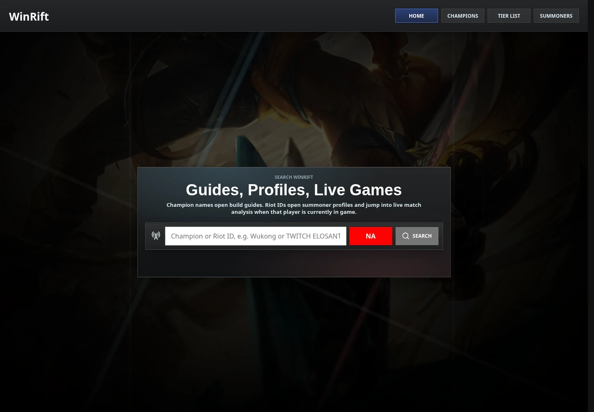
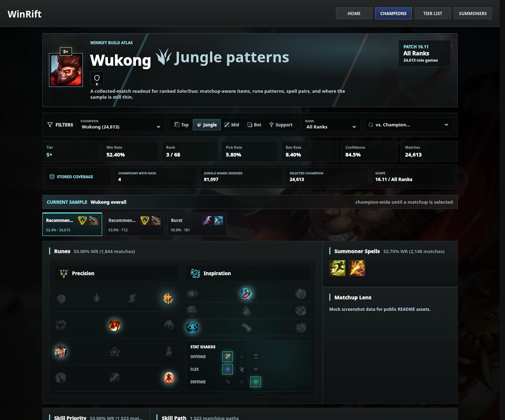
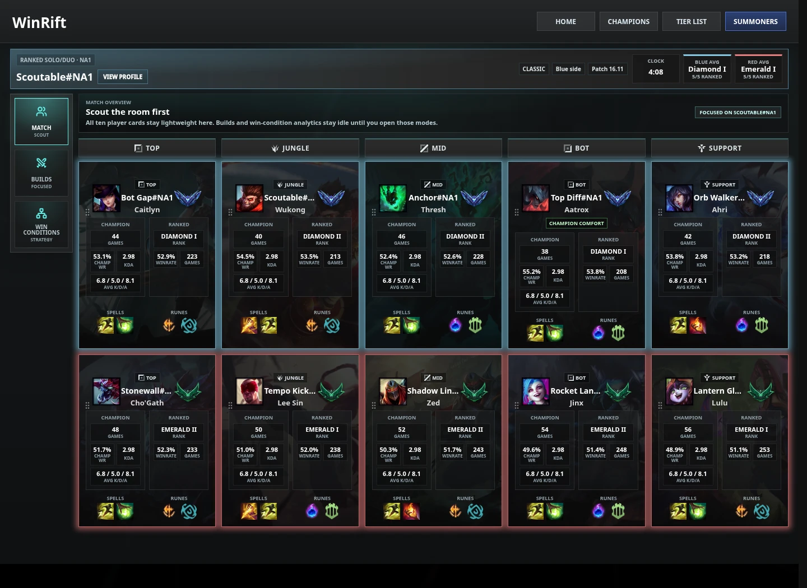
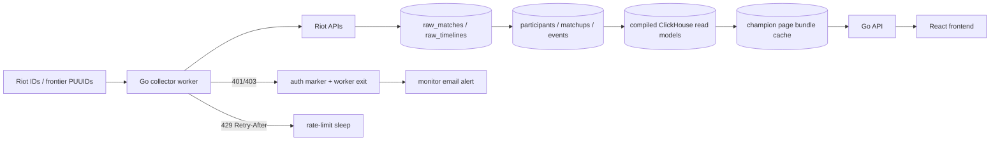

<p align="center">
  
</p>

<h1 align="center">Fast, Patch-Aware League Analytics</h1>

<p align="center">
  <a href="https://github.com/AdamWentworth/WinRift/actions/workflows/ci-core.yml"></a>
  <a href="https://github.com/AdamWentworth/WinRift/actions/workflows/ci-web.yml"></a>
  
  
  
  
</p>

WinRift is a solo portfolio application designed, built, deployed, and operated by **Adam Wentworth**. It turns Riot match and timeline data into fast, matchup-aware champion guides, live-game context, summoner profiles, tier lists, and team win-condition analysis.

The source is public for hiring and technical review. WinRift is not open source, does not accept outside contributions, and grants no permission to run, reuse, redistribute, deploy, or derive work from the code. See [LICENSE](LICENSE).

## Product

| Universal lookup | Champion guide |
|---|---|
|  |  |

| Live match scout |
|---|
|  |

- **Champion guides:** role- and patch-aware builds, runes, spells, skill orders, matchups, and build variants.
- **Focused matchup builds:** compare champion-wide item patterns with what performs into a selected opponent.
- **Champion directory and tier list:** browse the roster and rank champions by role using normalized performance signals.
- **Summoner profiles:** stored ranked summaries, champion performance, recent matches, and recent builds.
- **Live match scout:** Riot ID lookup, active-game detection, participant context, ranks, runes, spells, and focused matchup views.
- **Win conditions:** model composition strength across SplitPush, Pick, Siege, Control, and TeamFight axes without pretending aggregate data is real-time coaching.

## System

| Layer | Implementation |
|---|---|
| Frontend | React, TypeScript, Vite, TanStack Query |
| API | Go `net/http` services with typed handlers and response caching |
| Collection | Riot-aware Go worker with regional budgets, backoff, frontier scheduling, and rank/alias enrichment |
| Analytics | ClickHouse raw retention, normalized tables, compiled read models, and persistent page bundles |
| Operations | Docker Compose, private GHCR packages, GitHub Actions, health checks, rollback metadata, and SMTP monitoring |
| Deployment | Private home-server web, API, collector, monitor, and ClickHouse stack |



The frontend and API run on the server behind the same origin. The collector is deliberately separate from normal development startup so ordinary UI work cannot silently consume Riot API budget.

## Performance

Champion pages are served from persistent bundled responses rather than request-time raw-data scans. Worker startup prewarms every canonical champion for the current patch and every selectable archived patch; retained patches are refreshed on schedule, while immutable archived bundles remain reusable.

The August 27, 2026 production audit exercised every selectable champion/patch combination:

| Requests | Cache hits | Average | p95 | Maximum |
|---:|---:|---:|---:|---:|
| 1,557 | 1,557 | 11.6 ms | 20.3 ms | 40.1 ms |

Deployment gates verify:

- every canonical champion/patch response is complete and cache-backed,
- champion-page API latency stays within 500 ms,
- core browser routes reach page-specific ready markers within their budgets,
- request counts stay bounded so frontend waterfalls cannot quietly return,
- Go tests/vet, frontend tests/build, CodeQL, container scans, and SBOM generation pass.

See [Performance Guardrails](docs/product/performance-guardrails.md).

## Repository

```text
apps/web/       React frontend, Caddy image, and browser timing tests
core/           Go API, collector, monitor, patch tool, and analytics services
ops/prod/       Private-server Compose, deployment helpers, and operator tests
docs/           Curated analytics, data, quality, and operations references
.github/        CI, security scanning, performance, and deployment workflows
```

Selected references:

- [Data Dictionary](docs/data-dictionary.md)
- [Collector Runbook](docs/collector-runbook.md)
- [Production Operations](ops/prod/README.md)
- [Storage Policy](docs/storage-policy.md)
- [Performance Guardrails](docs/product/performance-guardrails.md)
- [Analytics Philosophy](docs/product/analytics-philosophy.md)
- [Win-Condition Validation](docs/product/win-condition-validation.md)

## Quality Gates

```bash
cd core
go test ./...
go vet ./...

cd ../apps/web
npm ci
npm test
npm run build
```

Production performance checks:

```bash
WINRIFT_PERF_BASE_URL=http://SERVER_LAN_IP:8000 \
WINRIFT_PERF_STRICT=1 \
ops/perf-smoke.sh

python3 ops/prod/champion-page-perf-audit.py \
  --base-url http://SERVER_LAN_IP:8000 \
  --max-ms 500 \
  --concurrency 4
```

`COLLECTOR_CURRENT_PATCH` is an operator-controlled ingestion boundary. Production currently targets `16.17`; rollover tooling advances it deliberately when Riot publishes the next patch.

## Ownership

Copyright © 2026 Adam Wentworth. All rights reserved.

Riot Games owns the names, trademarks, artwork, and Data Dragon material referenced by the project. WinRift is not endorsed by Riot Games. See [NOTICE.md](NOTICE.md).
