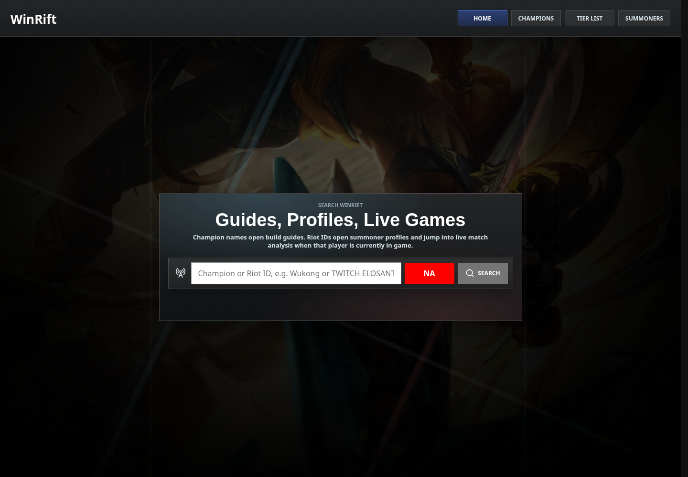
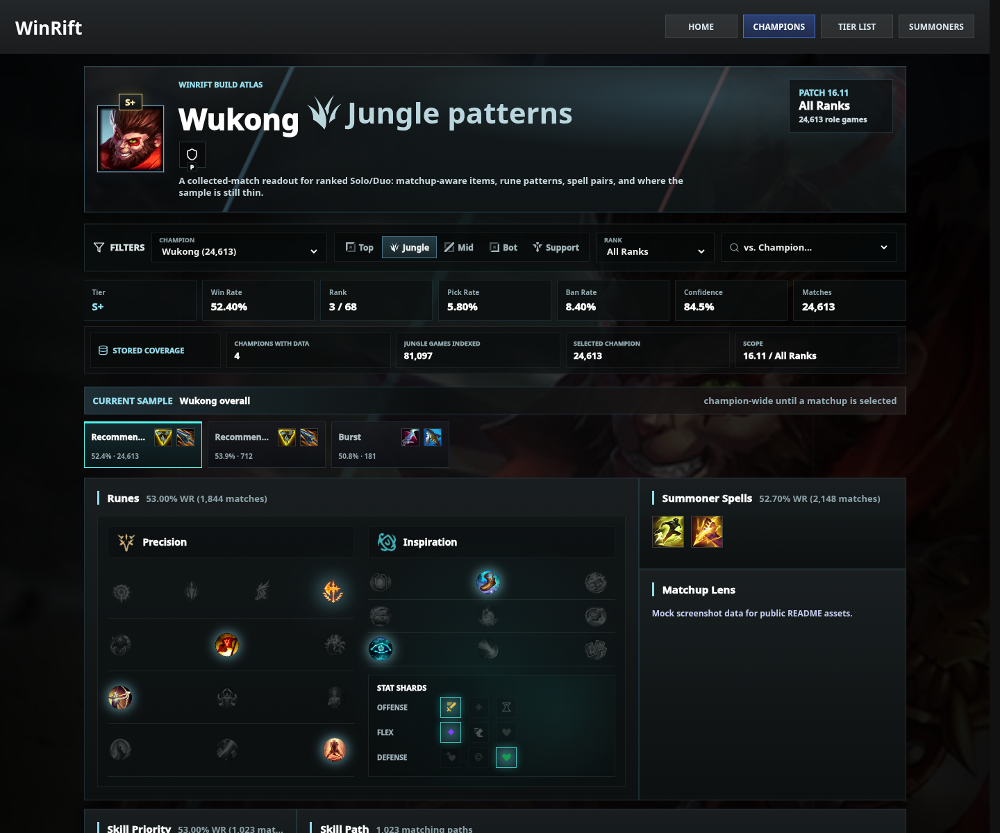
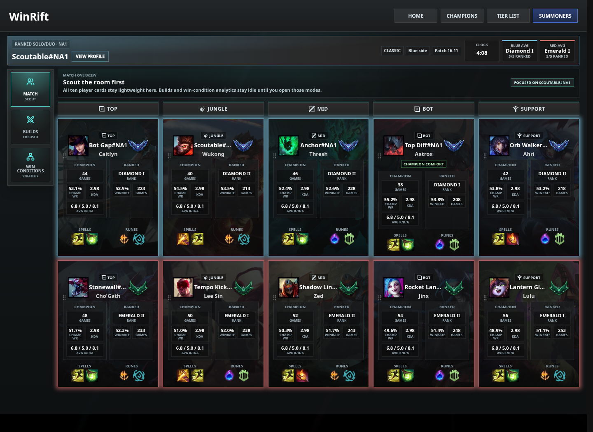
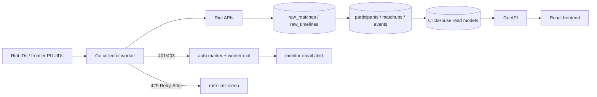

# ⚔️ WinRift - League Build Matchup Analytics

WinRift is a full-stack analytics project for League of Legends ranked data. It collects Riot match and timeline payloads, normalizes player builds and matchup context into ClickHouse, and serves a React app focused on practical build, rune, champion, summoner, and win-condition analysis.

The current rebuild is centered on one product idea: the best build is often matchup-specific. WinRift compares what champions build overall with what performs into the champion they are actually facing.

The original 2023 prototype has been retired from the working tree. Its useful product ideas, especially the win-condition model, are preserved in docs while the active runtime is the Go + ClickHouse + React implementation below.

---

## 📸 Screenshots

These screenshots use a deterministic local mock API for public documentation; production data is collected privately through the worker.

| Universal lookup | Champion guide |
|------------------|----------------|
|  |  |

| Live match scout |
|------------------|
|  |

---

## 📦 Monorepo Structure

```plaintext
WinRift/
├── apps/
│   └── web/                 # Vite + React + TypeScript frontend
├── services/
│   └── core/                # Go API, collector worker, monitor, patch archive tool
├── docs/                    # Architecture, product notes, runbooks, data docs
├── ops/
│   └── prod/                # Private server Docker Compose and deploy notes
├── .github/workflows/       # CI/CD for core images and private deployment
├── docker-compose.yml       # Local ClickHouse/API/web/worker stack
├── Makefile                 # Common local Docker commands
└── .env.example             # Safe local configuration template
```

---

## 🧰 Tech Stack Overview

| Layer | Tech | Notes |
|-------|------|-------|
| Frontend | Vite, React, TypeScript, TanStack Query | Live match, champion guides, tier list, summoner profiles |
| Core API | Go `net/http` | Typed handlers, Riot proxying, static-data cache, analytics read APIs |
| Collector | Go worker | Riot rate-limit aware match, timeline, rank, and alias ingestion |
| Monitor | Go worker-side monitor | API health, auth marker, worker container state, heartbeat logging, and SMTP alerting |
| Analytics Store | ClickHouse | Raw payload retention plus normalized tables and precomputed read models |
| Deployment | Docker Compose, GHCR, GitHub Actions | Private LAN API/worker deployment to a lightweight home server |
| Static Assets | Riot Data Dragon CDN | Champion, item, rune, spell, splash, and profile icon images |

Go is used for the API and collector because the target deployment is a lightweight home server: small binaries, low idle memory, straightforward concurrency, and explicit control over Riot API rate limits.

---

## ✨ Product Surface

- **Universal lookup**: search a champion or Riot ID from the homepage.
- **Live match scout**: resolve a Riot ID, detect live-game status, display participants, ranks, roles, spells, runes, and focused modes.
- **Focused build mode**: compare a searched player’s champion-wide build baseline against matchup-specific item paths.
- **Champion guides**: show role-aware runes, spells, starting items, item paths, skill orders, matchup context, and build variants.
- **Champion directory**: browse champions alphabetically with guide links.
- **Tier list**: rank champions by role using winrate, pick/ban pressure, and normalized performance signals.
- **Summoner profiles**: show stored ranked summaries, champion performance, and recently used builds.
- **Win-condition mode**: revive the legacy five-axis model: split push, pick, siege, control, and teamfight.

---

## 🧭 Project Status

WinRift is an active MVP rebuild. The core collection pipeline, ClickHouse schema, private deployment flow, live-match UI, champion guides, tier list, summoner profiles, and win-condition analytics are implemented enough to demonstrate the product direction.

The app is not yet a public hosted service. Current production-style use is private-LAN first: the server owns ClickHouse, API, and worker collection, while frontend development can happen from a laptop against that private API.

Near-term work:

- validate worker health/email alerting on the production server,
- tighten public deployment/auth policy before any internet-facing API,
- continue validating tier-list and win-condition scoring against larger samples,
- add more frontend smoke/e2e coverage around live-match and champion-guide flows.

---

## 🚀 Getting Started

### 1. Configure Environment

```bash
cp .env.example .env
editor .env
```

Set at least:

```env
RIOT_API_KEY=replace_with_your_riot_development_key
COLLECTOR_CURRENT_PATCH=16.11
```

The real `.env` is intentionally ignored. Do not commit Riot keys, ClickHouse passwords, or production LAN settings.

### 2. Start Local App Without Collector

```bash
make up
```

Open:

- Web app: `http://localhost:5173`
- API health: `http://localhost:8000/api/health`
- ClickHouse HTTP: `http://localhost:8123`

The collector is not started by default. That protects Riot API budget during normal frontend/backend development.

### 3. Start Collection Explicitly

```bash
make up-worker
make logs-worker
```

Stop only the worker while leaving ClickHouse and API up:

```bash
make stop-worker
```

Stop the full local stack, including the profiled worker:

```bash
make down
```

Run the local monitor profile when testing alert behavior:

```bash
make up-monitor
make logs-monitor
```

---

## 🧪 Local Development

### Core API

```bash
cd services/core
go run ./cmd/api
```

### Collector Worker

```bash
cd services/core
go run ./cmd/worker
```

### Patch Archive Tool

```bash
cd services/core
go run ./cmd/patchctl -action archive -patch 16.9 -platform ALL -queue 420 -retain-days 0
```

### Web App

```bash
cd apps/web
npm install
npm run dev
```

To run the frontend locally against a server-hosted private-LAN API:

```bash
cd apps/web
VITE_API_URL=http://SERVER_LAN_IP:8000 npm run dev
```

For day-to-day laptop work, put that value in ignored local Vite env:

```bash
cp apps/web/.env.example apps/web/.env.local
```

---

## ⚙️ Environment Overview

| Key | Purpose |
|-----|---------|
| `RIOT_API_KEY` | Riot development or production key. Never committed. |
| `COLLECTOR_PLATFORMS` | Comma-separated Riot platforms to collect from. |
| `COLLECTOR_CURRENT_PATCH` | Current patch collection target. |
| `COLLECTOR_PATCH_RETENTION_COUNT` | Number of recent raw patches to retain. |
| `COLLECTOR_RATE_LIMIT_REQUESTS` | Per-window request budget per Riot route region. |
| `COLLECTOR_RATE_LIMIT_WINDOW_SECONDS` | Rate-limit window, commonly `120`. |
| `RIOT_AUTH_FAILURE_EXIT` | Makes the worker stop on 401/403 auth failures. |
| `MONITOR_WORKER_STALE_AFTER_MINUTES` | Heartbeat age before stale-worker log observations. |
| `MONITOR_WORKER_CONTAINER_NAME` | Optional Docker container name for actual worker-down alerts. |
| `ALERT_EMAIL_ENABLED` | Enables SMTP alerts from the monitor. |
| `CLICKHOUSE_*` | ClickHouse host, port, database, user, and password. |
| `CORS_ORIGINS` | Browser origins allowed to call the API. |
| `VITE_API_URL` | Frontend API base URL. |

See [.env.example](.env.example) and [ops/prod/winrift.env.example](ops/prod/winrift.env.example) for the full set.

---

## 🔁 Data Flow



Collection stores enough raw data for current and recent patches, but the app is designed to rely on summary/read-model tables so old raw payloads can be archived or pruned without losing MVP analytics.

---

## 🔌 API Surface

| Endpoint | Purpose |
|----------|---------|
| `GET /api/health` | Health check |
| `POST /api/account/resolve` | Riot ID to PUUID/profile resolution |
| `GET /api/live-game` | Live game lookup by Riot ID |
| `GET /api/summoner/profile` | Stored summoner overview and build usage |
| `GET /api/analytics/champion-page` | Bundled champion page payload |
| `GET /api/analytics/champion-guides` | Champion guide index and tier-list source data |
| `GET /api/analytics/build-advice` | Champion-wide and matchup-specific build advice |
| `GET /api/analytics/builds` | Aggregate build/rune/spell rows |
| `POST /api/analytics/win-conditions` | Win-condition pairing read model |
| `GET /api/static/{kind}` | Data Dragon champions, items, runes, summoner spells |
| `POST /api/dev/collector/seed` | Local/dev seed endpoint |

Development-only endpoints are intended for local or private-LAN use, not public traffic.

---

## 📚 Documentation Map

| Workspace | README |
|-----------|--------|
| Web app | [apps/web/README.md](apps/web/README.md) |
| Go core service | [services/core/README.md](services/core/README.md) |
| Production ops | [ops/prod/README.md](ops/prod/README.md) |

| Area | Docs |
|------|------|
| System architecture | [docs/architecture.md](docs/architecture.md) |
| Riot API behavior | [docs/riot-api.md](docs/riot-api.md) |
| Data model | [docs/data-dictionary.md](docs/data-dictionary.md) |
| Collector operations | [docs/collector-runbook.md](docs/collector-runbook.md) |
| ClickHouse queries | [docs/clickhouse-queries.md](docs/clickhouse-queries.md) |
| Patch retention | [docs/patch-lifecycle.md](docs/patch-lifecycle.md) |
| Deployment | [docs/ops-deployment.md](docs/ops-deployment.md) |
| Storage policy | [docs/storage-policy.md](docs/storage-policy.md) |
| Live UX policy | [docs/policy-safe-live-ux.md](docs/policy-safe-live-ux.md) |
| Public repo readiness | [docs/public-release-readiness.md](docs/public-release-readiness.md) |
| Product roadmap | [docs/product/remaining-work.md](docs/product/remaining-work.md) |

Product-specific docs:

- [Build Guides](docs/product/build-guides.md)
- [Tier List Ranking](docs/product/tier-list-ranking.md)
- [Summoner Profiles](docs/product/summoner-profiles.md)
- [Analytics Philosophy](docs/product/analytics-philosophy.md)
- [Global Background System](docs/product/global-background-system.md)

Discussion notes:

- [Match Collection](docs/discussions/match-collection.md)
- [Build Matchup Analytics](docs/discussions/build-matchup-analytics.md)
- [Win Conditions](docs/discussions/win-conditions.md)
- [Legacy Win Condition Audit](docs/legacy-win-condition-audit.md)

---

## 🧪 Verification

Core tests:

```bash
cd services/core
go test ./...
```

Web tests and production build:

```bash
cd apps/web
npm test
npm run build
```

Local Docker smoke:

```bash
make up
curl http://localhost:8000/api/health
```

---

## 🔐 Security And API Safety

- Real Riot keys live only in local/server `.env` files.
- The worker exits on Riot auth failure when `RIOT_AUTH_FAILURE_EXIT=true`.
- The monitor can email on Riot auth failure, API failure, or a worker container that is actually down. Stale heartbeat observations stay in logs.
- Riot 429 responses honor `Retry-After` and back off before continuing.
- The collector has per-platform request budgeting and reserve capacity.
- The public app should present contextual statistics, not automated real-time commands.
- Production API/worker deployment is currently private-LAN oriented, not a public internet service.

WinRift is not endorsed by Riot Games and does not reflect the views or opinions of Riot Games or anyone officially involved in producing or managing Riot Games properties.

This repository is source-available for portfolio review and technical discussion, but it is not open source. Reuse, deployment, redistribution, or derivative work requires prior written permission; see [LICENSE](LICENSE).

Riot-owned names, icons, splash art, and screenshots containing Riot imagery are not licensed by this repository; see [NOTICE.md](NOTICE.md).

---

## 🗃️ Storage And Patch Lifecycle

WinRift keeps raw match/timeline payloads for the current and most recent patches, while summary tables preserve app-facing analytics for archived patches. This keeps ClickHouse storage practical on small hardware while allowing trends to remain visible by patch.

Typical lifecycle:

1. Collect current patch raw data.
2. Refresh read models every few minutes.
3. When a new patch arrives, retain the prior patch as recent history.
4. Archive older raw payloads after summaries are materialized.
5. Continue serving archived patch summaries from smaller read-model tables.

---

## 🌐 Deployment Model

The current production shape is intentionally private:

- ClickHouse, API, and worker run on the home server.
- The monitor runs beside them and sends private SMTP alerts.
- The worker collects from the server only.
- The API is available on the private LAN.
- The frontend can be developed on a laptop while pointing to the server API.
- GitHub Actions build and deploy the Go core image to the server through a self-hosted runner.

See [ops/prod/README.md](ops/prod/README.md) and [docs/ops-deployment.md](docs/ops-deployment.md).

---

## 🧠 Author Notes

WinRift started as an experiment in modeling League team win conditions. The rebuild keeps that strategic idea, but puts the foundation on matchup-specific builds, trustworthy data collection, and precomputed analytics that can load quickly in a real app.

The project is still an MVP, but the architecture is intentionally shaped for long-running collection, patch-aware analytics, and public-facing product polish.
