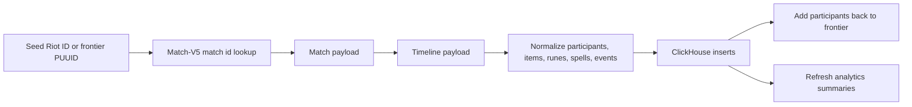

# Core Service (Go)

`core` contains WinRift's Go runtime: the private API, Riot collector worker, health monitor, ClickHouse schema, analytics read models, and patch archive tool.

## Highlights

- Single Go module with separate `api`, `worker`, `monitor`, and `patchctl` binaries.
- Riot API client with route/platform mapping, `Retry-After` handling, auth-failure tripwire, and request logging.
- ClickHouse repository layer for raw payloads, normalized participants, build analytics, win-condition metrics, and summoner profiles.
- Collector frontier system for long-running match discovery without random API probing.
- Precomputed read models for item slots, champion guides, win conditions, and summoner profiles.

## Layout

```plaintext
core/
├── cmd/
│   ├── api/          # HTTP API entrypoint
│   ├── monitor/      # Runtime health and email alert monitor
│   ├── worker/       # Riot collector + analytics refresh worker
│   └── patchctl/     # Patch archive/prune command
├── internal/
│   ├── analytics/    # Match/timeline normalization
│   ├── api/          # HTTP handlers and response shaping
│   ├── clickhouse/   # Schema, inserts, queries, read models
│   ├── collector/    # Frontier collection, rank/alias enrichment
│   ├── config/       # Environment loading and defaults
│   ├── riot/         # Riot client and regional routing
│   ├── staticdata/   # Data Dragon metadata
│   └── winconditions/# Champion profiles and deterministic narratives
└── testdata/         # Sanitized fixtures
```

## HTTP API

| Endpoint | Purpose |
|----------|---------|
| `GET /api/health` | Health check |
| `POST /api/account/resolve` | Riot ID account resolution |
| `GET /api/account/alias` | Stored alias lookup |
| `GET /api/account/aliases` | Stored alias autocomplete |
| `GET /api/summoner/profile` | Stored summoner profile summary |
| `GET /api/summoners/leaderboard` | Stored ranked-player index |
| `GET /api/live-game` | Live match lookup and enrichment |
| `GET /api/analytics/builds` | Build aggregate query |
| `GET /api/analytics/champion-page` | Bundled champion guide payload |
| `GET /api/analytics/champion-guides` | Champion guide index and tier-list input |
| `GET /api/analytics/build-advice` | Champion-wide and matchup-specific build advice |
| `GET /api/analytics/item-slots` | Item slot read model |
| `POST /api/analytics/item-slots/batch` | Batch item slot lookup |
| `GET /api/analytics/champion-roles` | Champion role distribution |
| `GET /api/analytics/patches` | Current and archived analytics patches |
| `POST /api/analytics/win-conditions` | Win-condition pairing metrics |
| `GET /api/analytics/win-conditions/diagnostics` | Win-condition diagnostics |
| `GET /api/analytics/win-conditions/validation` | Model validation report |
| `GET /api/static/{kind}` | Data Dragon metadata |
| `POST /api/dev/collector/seed` | Local/dev collection seed endpoint |

Development-only refresh routes rebuild item-slot, champion-guide, and summoner-profile read models. They are disabled outside development.

## Riot Integration

Player-facing identity uses Riot IDs (`gameName#tagLine`). Account-V1 resolves Riot IDs to PUUIDs; Match-V5 supplies match and timeline payloads; League-V4 supplies cached ranked snapshots; Spectator-V5 supplies active-game context. Platform and regional routing are centralized in `internal/riot`.

The Riot client reads its key from the environment, never logs it, treats `404` as ordinary absence, and honors bounded `429 Retry-After` responses. A `401` or `403` writes the shared authentication marker: the worker stops, while the API remains available for cached, static, and analytics traffic and returns `503 RIOT_API_KEY_UNAVAILABLE` only for Riot-dependent endpoints.

## Environment Variables

### Minimal Local `.env`

```env
RIOT_API_KEY=replace_with_your_riot_development_key
ENVIRONMENT=development
HTTP_ADDR=:8000
DEFAULT_PLATFORM=NA1
COLLECTOR_PLATFORMS=NA1

CLICKHOUSE_HOST=localhost
CLICKHOUSE_PORT=9000
CLICKHOUSE_DATABASE=winrift
CLICKHOUSE_USER=winrift
CLICKHOUSE_PASSWORD=winrift

CORS_ORIGINS=http://localhost:5173
COLLECTOR_CURRENT_PATCH=16.17
```

The collector patch is an explicit ingestion boundary rather than an automatic rollout. Update it deliberately when Riot advances to a new patch; frontend patch selection is driven by the API's current-patch response.

### Important Runtime Knobs

| Key | Default | Notes |
|-----|---------|-------|
| `API_REQUEST_LOGS_ENABLED` | `true` | Emits route, status, duration, byte count, and cache marker per API request. |
| `API_SLOW_REQUEST_MS` | `500` | Marks API request log lines as slow after this threshold. |
| `RIOT_AUTH_FAILURE_EXIT` | `true` | Stops the worker on 401/403 so an expired key does not loop. |
| `RIOT_RATE_LIMIT_MAX_SLEEP_SECONDS` | `120` | Maximum backoff after Riot rate-limit responses. |
| `COLLECTOR_RATE_LIMIT_REQUESTS` | `100` | Request budget per rate-limit window. |
| `COLLECTOR_RATE_LIMIT_WINDOW_SECONDS` | `120` | Riot development-key window used by the worker budget. |
| `COLLECTOR_RATE_LIMIT_RESERVE_REQUESTS` | `10` | Keeps headroom for non-collector requests. |
| `COLLECTOR_PATCH_RETENTION_COUNT` | `2` | Raw current + recent patch retention target. |
| `MONITOR_WORKER_STALE_AFTER_MINUTES` | `15` | Heartbeat age before the monitor logs a stale observation. |
| `WORKER_REFRESH_STATUS_PATH` | `/run/winrift/worker-refresh-status.json` | Runtime JSON snapshot of summary-refresh health. |
| `MONITOR_WORKER_CONTAINER_NAME` | empty | Optional Docker container name for worker-down alerts. |
| `MONITOR_STARTUP_GRACE_SECONDS` | `120` | Grace window before startup worker-down alerts. |
| `ALERT_EMAIL_ENABLED` | `false` | Enables SMTP email alerts from `/winrift-monitor`. |
| `RANK_ENRICHMENT_ENABLED` | `false` | Background rank enrichment lane. |
| `LIVE_RANK_ENRICHMENT_ENABLED` | `true` | Rank enrichment for live-game response context. |
| `ITEM_SLOT_ANALYTICS_REFRESH_INTERVAL_MINUTES` | `10` | Item slot read-model refresh cadence. |
| `CHAMPION_GUIDE_ANALYTICS_REFRESH_INTERVAL_MINUTES` | `10` | Champion guide read-model refresh cadence. |
| `WIN_CONDITION_ANALYTICS_REFRESH_INTERVAL_MINUTES` | `15` | Win-condition read-model refresh cadence. |

## Local Run

Start ClickHouse from the repo root:

```bash
docker compose up -d clickhouse
```

Run the API:

```bash
cd core
go run ./cmd/api
```

Run the worker:

```bash
cd core
go run ./cmd/worker
```

Run the monitor:

```bash
cd core
MONITOR_API_HEALTH_URL=http://localhost:8000/api/health go run ./cmd/monitor
```

Run patch archive tooling:

```bash
cd core
go run ./cmd/patchctl -action archive -patch 16.9 -platform ALL -queue 420 -retain-days 0
```

## Testing

```bash
cd core
go test ./...
```

Tests use sanitized fixtures under `testdata/`. Do not reintroduce raw user/account payloads as fixtures.

## Collector Flow



The worker discovers through real participants from stored ranked games. It does not guess IDs or brute-force Riot APIs.

## ClickHouse Model

Core table groups:

- Raw current/recent payloads: `raw_matches`, `raw_timelines`
- Normalized facts: `participants`, `participant_matchups`, timeline-derived item/event tables
- Lookup/enrichment: account aliases, rank snapshots, frontier state
- Read models: build advice, champion guides, item slots, win conditions, summoner profiles
- Archive summaries: retained derived data for patches whose bulky raw payloads have been pruned

The schema source of truth is [internal/clickhouse/schema.sql](internal/clickhouse/schema.sql).

## Safety Notes

- The API key is read from environment only.
- API keys are not logged.
- 401/403 marks auth failure and stops the worker when configured.
- 429 responses honor Riot `Retry-After`.
- Dev-only endpoints should stay private to localhost or private LAN.
