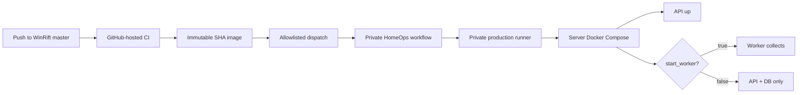

# WinRift Production Operations

`ops/prod` documents WinRift's production contract and retains owner maintenance tools. GitHub-hosted WinRift CI publishes immutable images; the separate private HomeOps repository owns the production runner, fixed Compose model, deployment scripts, health gates, and rollback authority. Public-repository workflow code never executes on the home server.

## Services

| Service | Purpose | Notes |
|---------|---------|-------|
| `winrift_clickhouse` | Persistent analytics database | Data, hot data, logs, and backups should live on the storage SSD. |
| `winrift_web` | Production React application | Caddy serves static assets and proxies same-origin `/api` requests. |
| `winrift_api` | Private-LAN API | Bound to `0.0.0.0:8000` by default. |
| `winrift_worker` | Riot collector worker | Auth failures remain stopped; unexpected failures receive three bounded restart attempts. |
| `winrift_monitor` | Health and alert monitor | Watches API health, Riot auth marker, and worker heartbeat. |

The server-hosted frontend listens on private-LAN port `8082` by default and proxies `/api` to the internal API container.

## Runtime State

```plaintext
/srv/winrift/
├── .env              # Server-local secrets/config, never committed
├── schema.sql        # Deployed ClickHouse schema
├── runtime/          # Auth markers, worker heartbeat, monitor alert state
└── deployments/      # Core and web deployment metadata

/mnt/storage/clickhouse/
├── data/             # ClickHouse data files
├── hot/              # Large raw-timeline parts
├── logs/             # ClickHouse logs
└── backups/          # Manual or scheduled backups
```

Leave ClickHouse paths pointed at `/mnt/storage/clickhouse/...` so database files land on the second SSD, not the OS disk.

ClickHouse system diagnostics are intentionally bounded by `ops/clickhouse` config mounted into the server:

- per-query/profile logging is disabled for the default profile,
- the high-frequency `query_metric_log` is disabled,
- `text_log` is warning-level,
- ClickHouse system log tables use a one-day TTL.

This prevents ClickHouse diagnostics from growing without relation to the WinRift dataset.

## Server Bootstrap

Run once on the server:

```bash
sudo mkdir -p /srv/winrift
sudo chown -R $USER:$USER /srv/winrift

findmnt /mnt/storage
sudo mkdir -p /mnt/storage/clickhouse/{data,hot,logs,backups}
sudo chown -R $USER:$USER /mnt/storage/clickhouse

cp ops/prod/winrift.env.example /srv/winrift/.env
editor /srv/winrift/.env
```

Set the real Riot key, ClickHouse password, current patch, platform list, and storage paths.

## Important Environment

| Key | Purpose |
|-----|---------|
| `RIOT_API_KEY` | Server Riot key used by API/live lookups and worker collection. |
| `CLICKHOUSE_PASSWORD` | Strong production ClickHouse password. |
| `COLLECTOR_CURRENT_PATCH` | Current patch target for collection. |
| `COLLECTOR_PLATFORMS` | Comma-separated platforms the server collects. |
| `RIOT_AUTH_FAILURE_EXIT` | Should stay `true` so the worker stops when the key expires. |
| `WINRIFT_STORAGE_MOUNT` | Mount guard, usually `/mnt/storage`. |
| `WINRIFT_CLICKHOUSE_DATA_DIR` | ClickHouse data directory on storage SSD. |
| `WINRIFT_CLICKHOUSE_HOT_DIR` | Large raw-timeline parts on the storage SSD. |
| `WINRIFT_CLICKHOUSE_CONFIG_DIR` | Mounted ClickHouse config override directory. |
| `WINRIFT_CLICKHOUSE_USERS_DIR` | Mounted ClickHouse user/profile override directory. |
| `WINRIFT_RUNTIME_STATE_DIR` | Shared runtime marker directory. |
| `WINRIFT_WEB_BIND` | Private-LAN address used by the production web container. |
| `WINRIFT_WEB_PORT` | Host port for the production web app; defaults to `8082`. |
| `API_REQUEST_LOGS_ENABLED` | Enables grep-friendly API timing logs. |
| `WORKER_REFRESH_STATUS_PATH` | Runtime JSON file for worker refresh health. |
| `ANALYTICS_REFRESH_SCHEDULER_INTERVAL_SECONDS` | Background summary/prewarm cadence; only one due refresh family runs per tick. |
| `MONITOR_WORKER_REQUIRED` | Set `true` when the collector is expected to be running. |
| `MONITOR_WORKER_CONTAINER_NAME` | Set to `winrift_worker` so the monitor emails only when the worker container is actually down. |
| `MONITOR_STARTUP_GRACE_SECONDS` | Short deploy/startup grace window before worker-down emails are eligible. |
| `ALERT_EMAIL_ENABLED` | Enables SMTP email alerts for auth failure or down worker state. |
| `SMTP_TO` | Comma-separated alert recipient list. |

## Production Web and Laptop Development

Open the deployed private-LAN application at:

```text
http://SERVER_LAN_IP:8082
```

The production build uses same-origin `/api` requests, so browsers do not need a separate API URL or CORS exception.

For local Vite development against the server API:

```bash
cd apps/web
VITE_API_URL=http://SERVER_LAN_IP:8000 npm run dev
```

This lets the server keep collecting and serving data while the laptop only runs the frontend dev server.

## Deployment Flow

Core and web CI run entirely on GitHub-hosted runners. After verification and container scanning, each pipeline publishes a private `sha-<commit>` GHCR image carrying an OCI revision label and the component's deployment-verification assets. Production never deploys `latest`.

When automatic dispatch is enabled, the successful component pipeline sends only the allowlisted repository identity, full `master` SHA, and component name to HomeOps. HomeOps independently confirms that SHA is the current WinRift `master`, pulls the corresponding private image, verifies its embedded revision, resolves its repository digest, and serializes the deployment on the private production runner. Manual deployments use the same HomeOps workflow and validation path.

Core deployment keeps collection quiet during API replacement, restores the monitor and optional worker, waits for current and archived champion-page prewarming, and audits every champion/selectable-patch response at a 500 ms ceiling. Web deployment verifies container health, same-origin API proxying, deep routes, immutable asset caching, and strict browser route budgets. Either component rolls back to its previous digest if any deployment gate fails.

The WinRift repository variable `HOMEOPS_AUTO_DEPLOY=true` enables dispatch only after `HOMEOPS_DISPATCH_TOKEN` is configured with narrowly scoped permission to create dispatches in HomeOps. HomeOps must also have GitHub Actions read access to the private `winrift-core` and `winrift-web` packages. Until those controls are configured, CI still publishes immutable images and production deployment remains manually available from HomeOps.

The production host also uses `docker-image-retention.timer` to keep deployment images from filling the OS disk. Once a week it checks root filesystem usage. If usage is at least 65%, it removes images that are older than seven days and are not referenced by any container. Running and stopped containers, volumes, and build caches are left alone.

Install or refresh the maintenance timer with:

```bash
sudo install -m 0755 ops/prod/prune-docker-images.sh /usr/local/sbin/winrift-prune-docker-images
sudo install -m 0644 ops/prod/systemd/docker-image-retention.service /etc/systemd/system/docker-image-retention.service
sudo install -m 0644 ops/prod/systemd/docker-image-retention.timer /etc/systemd/system/docker-image-retention.timer
sudo systemctl daemon-reload
sudo systemctl enable --now docker-image-retention.timer
```



## Common Commands

Refresh the daily Riot development key:

```bash
riotkey
```

The helper hides the key, requires confirmation, preserves the deployed immutable image, performs bounded patch rollover when needed, recreates the API, and restores monitoring and collection. It is resumable and skips completed maintenance batches. Use `/srv/winrift/refresh-riot-key` when the shortcut is unavailable, `--no-patch-rollover` for a deliberate key-only refresh, and `--show-key` only when full-key display is intentional.

The key-rotation helper remains server-local during the HomeOps migration. To install or refresh it manually:

```bash
install -m 0644 ops/prod/docker-compose.yml /srv/winrift/docker-compose.yml
install -m 0755 ops/prod/refresh-riot-key.sh /srv/winrift/refresh-riot-key
install -m 0755 ops/prod/riotkey.sh /usr/local/bin/riotkey
```

Start API, monitor, and ClickHouse:

```bash
cd /srv/winrift
docker compose --env-file /srv/winrift/.env up -d clickhouse api monitor
```

Start the worker explicitly:

```bash
cd /srv/winrift
docker compose --profile worker --env-file /srv/winrift/.env up -d worker
```

Follow worker logs:

```bash
docker logs -f winrift_worker
```

Follow monitor logs:

```bash
docker logs -f winrift_monitor
```

Check ClickHouse storage by database:

```bash
cd /srv/winrift
docker compose exec clickhouse clickhouse-client --query "
  SELECT database, formatReadableSize(sum(bytes_on_disk)) AS active_size, sum(rows) AS rows
  FROM system.parts
  WHERE active
  GROUP BY database
  ORDER BY sum(bytes_on_disk) DESC"
```

If system logs ever grow unexpectedly again, first confirm the config is mounted and active, then clear only ClickHouse diagnostics:

```bash
cd /srv/winrift
docker compose exec clickhouse clickhouse-client --multiquery --query "
  SYSTEM FLUSH LOGS;
  TRUNCATE TABLE IF EXISTS system.text_log;
  TRUNCATE TABLE IF EXISTS system.processors_profile_log;
  TRUNCATE TABLE IF EXISTS system.query_log;
  TRUNCATE TABLE IF EXISTS system.query_views_log;
  TRUNCATE TABLE IF EXISTS system.part_log;
  TRUNCATE TABLE IF EXISTS system.trace_log;
  TRUNCATE TABLE IF EXISTS system.metric_log;
  TRUNCATE TABLE IF EXISTS system.asynchronous_metric_log;
  TRUNCATE TABLE IF EXISTS system.query_metric_log;"
```

When ClickHouse changes system-log engine definitions, old tables may be retained with `_0` suffixes. Those are diagnostic history only and can be dropped after verifying the new log tables are tiny:

```bash
docker compose exec clickhouse clickhouse-client --multiquery --query "
  DROP TABLE IF EXISTS system.text_log_0 SYNC;
  DROP TABLE IF EXISTS system.processors_profile_log_0 SYNC;
  DROP TABLE IF EXISTS system.query_log_0 SYNC;
  DROP TABLE IF EXISTS system.query_views_log_0 SYNC;
  DROP TABLE IF EXISTS system.part_log_0 SYNC;
  DROP TABLE IF EXISTS system.trace_log_0 SYNC;
  DROP TABLE IF EXISTS system.metric_log_0 SYNC;
  DROP TABLE IF EXISTS system.asynchronous_metric_log_0 SYNC;
  DROP TABLE IF EXISTS system.query_metric_log_0 SYNC;"
```

Stop the worker only:

```bash
cd /srv/winrift
docker compose --profile worker --env-file /srv/winrift/.env stop worker
```

## Archive an Old Patch

After a Riot patch rolls over and the collector window moves on, archive the old patch before pruning:

```bash
cd /srv/winrift
docker compose --env-file /srv/winrift/.env run --rm api \
  /winrift-patchctl -action archive -patch 16.9 -platform ALL -queue 420 -retain-days 0
```

This keeps app summaries and the small normalized lookup index, while deleting bulky raw/timeline payloads.

## Safety Notes

- Keep `/srv/winrift/.env` server-local and uncommitted.
- Keep `winrift_worker` on `restart: "no"`.
- If the Riot key expires, the worker should stop and the API should stay up.
- Keep `winrift_monitor` on `restart: unless-stopped` so it can email when the worker stops unexpectedly. The monitor mounts the Docker socket read-only to inspect `winrift_worker`; this is intentionally private-server-only plumbing.
- Do not expose this deployment publicly until auth, rate limiting, observability, and public API policy are finalized.
