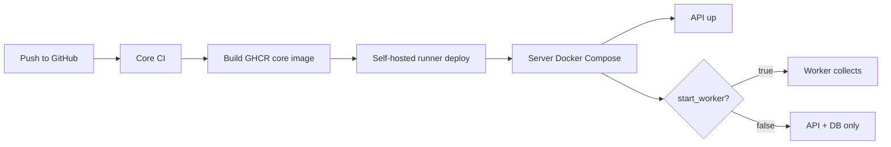

# WinRift Production Ops 🚀

`ops/prod` contains the private server deployment shape for WinRift's core runtime. It is designed for a home-server setup where ClickHouse, the API, and the collector worker run on the server while frontend development can continue from a laptop against the private-LAN API.

## 📦 What Runs

| Service | Purpose | Notes |
|---------|---------|-------|
| `winrift_clickhouse` | Persistent analytics database | Data/logs/backups should live on the storage SSD. |
| `winrift_api` | Private-LAN API | Bound to `0.0.0.0:8000` by default. |
| `winrift_worker` | Riot collector worker | Started explicitly, `restart: "no"` to avoid expired-key loops. |
| `winrift_monitor` | Health and alert monitor | Watches API health, Riot auth marker, and worker heartbeat. |

The frontend is intentionally not deployed here yet. Run it locally with `VITE_API_URL` pointed at the server API.

## 🗂️ Runtime State

```plaintext
/srv/winrift/
├── .env              # Server-local secrets/config, never committed
├── schema.sql        # Deployed ClickHouse schema
├── runtime/          # Auth markers, worker heartbeat, monitor alert state
└── deployments/      # Deployment metadata

/mnt/storage/clickhouse/
├── data/             # ClickHouse data files
├── logs/             # ClickHouse logs
└── backups/          # Manual or scheduled backups
```

Leave ClickHouse paths pointed at `/mnt/storage/clickhouse/...` so database files land on the second SSD, not the OS disk.

## 🧰 Server Bootstrap

Run once on the server:

```bash
sudo mkdir -p /srv/winrift
sudo chown -R $USER:$USER /srv/winrift

findmnt /mnt/storage
sudo mkdir -p /mnt/storage/clickhouse/{data,logs,backups}
sudo chown -R $USER:$USER /mnt/storage/clickhouse

cp ops/prod/winrift.env.example /srv/winrift/.env
editor /srv/winrift/.env
```

Set the real Riot key, ClickHouse password, current patch, platform list, and storage paths.

For the one-time laptop database copy, follow [data-migration.md](data-migration.md).

## ⚙️ Important Environment

| Key | Purpose |
|-----|---------|
| `RIOT_API_KEY` | Server Riot key used by API/live lookups and worker collection. |
| `CLICKHOUSE_PASSWORD` | Strong production ClickHouse password. |
| `COLLECTOR_CURRENT_PATCH` | Current patch target for collection. |
| `COLLECTOR_PLATFORMS` | Comma-separated platforms the server collects. |
| `RIOT_AUTH_FAILURE_EXIT` | Should stay `true` so the worker stops when the key expires. |
| `WINRIFT_STORAGE_MOUNT` | Mount guard, usually `/mnt/storage`. |
| `WINRIFT_CLICKHOUSE_DATA_DIR` | ClickHouse data directory on storage SSD. |
| `WINRIFT_RUNTIME_STATE_DIR` | Shared runtime marker directory. |
| `MONITOR_WORKER_REQUIRED` | Set `true` when the collector is expected to be running. |
| `ALERT_EMAIL_ENABLED` | Enables SMTP email alerts for auth failure or stale worker state. |
| `SMTP_TO` | Comma-separated alert recipient list. |

## 🖥️ Laptop Development Against Server API

```bash
cd apps/web
VITE_API_URL=http://SERVER_LAN_IP:8000 npm run dev
```

This lets the server keep collecting and serving data while the laptop only runs the frontend dev server.

## 🔁 Deployment Flow



See [../../docs/ops-deployment.md](../../docs/ops-deployment.md) for the full runbook.

## 🧭 Common Commands

Start API, monitor, and ClickHouse:

```bash
cd /srv/winrift
docker compose --env-file /srv/winrift/.env up -d clickhouse api monitor
```

Start the worker explicitly:

```bash
cd /srv/winrift
docker compose --profile worker --env-file /srv/winrift/.env up -d worker
```

Follow worker logs:

```bash
docker logs -f winrift_worker
```

Follow monitor logs:

```bash
docker logs -f winrift_monitor
```

Stop the worker only:

```bash
cd /srv/winrift
docker compose --profile worker --env-file /srv/winrift/.env stop worker
```

## 🗃️ Archive An Old Patch

After a Riot patch rolls over and the collector window moves on, archive the old patch before pruning:

```bash
cd /srv/winrift
docker compose --env-file /srv/winrift/.env run --rm api \
  /winrift-patchctl -action archive -patch 16.9 -platform ALL -queue 420 -retain-days 0
```

This keeps app summaries and the small normalized lookup index, while deleting bulky raw/timeline payloads.

## 🔐 Safety Notes

- Keep `/srv/winrift/.env` server-local and uncommitted.
- Keep `winrift_worker` on `restart: "no"`.
- If the Riot key expires, the worker should stop and the API should stay up.
- Keep `winrift_monitor` on `restart: unless-stopped` so it can email when the worker stops unexpectedly.
- Do not expose this deployment publicly until auth, rate limiting, observability, and public API policy are finalized.
